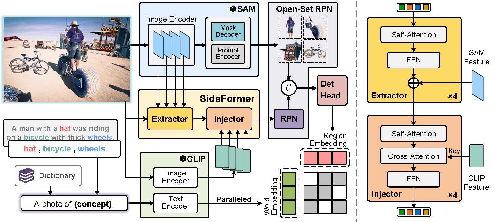

# Sambor

> **[Boosting Segment Anything Model Towards Open-Vocabulary Learning](https://arxiv.org/abs/2312.03628)** 
> Xumeng Han, Longhui Wei, Xuehui Yu, Zhiyang Dou, Xin He, Kuiran Wang, Zhenjun Han, Qi Tian 

## Method

<em> **Overall architecture of Sambor. (Left)** We construct a SideFormer to extract features from SAM and inject CLIP visual features to enhance semantic understanding. Building upon a two-stage detector, we devise an Open-set RPN that augments the vanilla RPN with open-set proposals generated by SAM. The language branch of CLIP encodes concepts in parallel, thereby empowering the detector with open-vocabulary recognition. **(Right)** The specific implementations of the extractor and injector in SideFormer.
</em>
